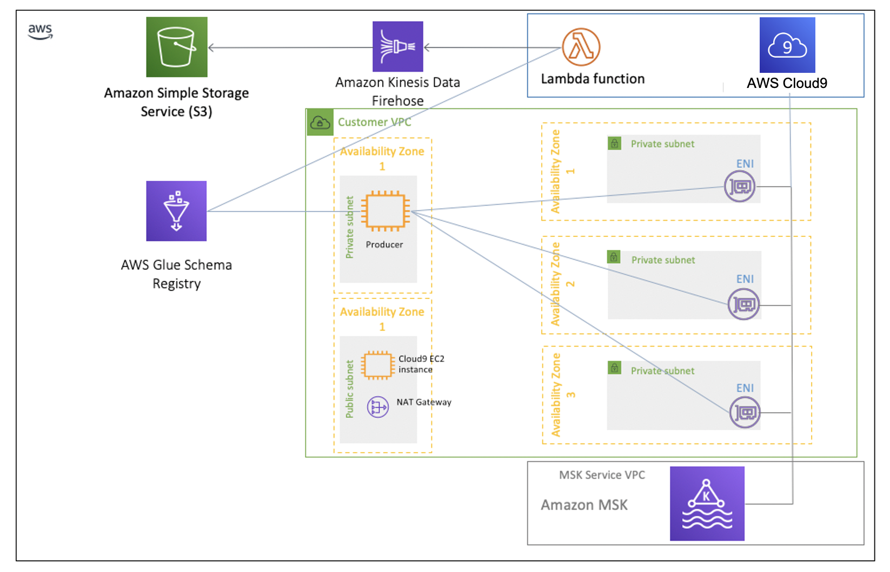

# Working with Glue Schema Registry and Lambda MSK Consumers

Most of this code was taken from the [MSK Workshop](https://amazonmsk-labs.workshop.aws/en/msklambda/gsrschemareg/overview.html). I wanted to simplify getting a test setup with the producer in Cloud9 and the consuming Lambda function. Both the producer and consumer code has been combined into one and I created a CDK script to create the necessary resources for use with the Glue Schema Registry.



# Getting Started
This code assumes knowledge of Java, Maven, and the [AWS CDK](https://docs.aws.amazon.com/cdk/latest/guide/getting_started.html). These tools are required to be installed on the developer machine before running. This project also used [`Projen`](https://github.com/projen/projen) to geenrate the CDK infrastructure project in the `infra` directory. 

This project was tested with Open JDK version 17 and Maven 3.8.3 and AWS CDK 1.130.0 and other versions may or may not work. 

## Compiling the JAR
The  producer and consumer will be created in the jar and the Click.avsc Avro file will be created into a Java POJO for use in the project. The command below with also move the shaded jar into the `infra/scripts` directory for use with deploying with CDK.

```bash
mvn package
```

## Building the Stacks
As I was testing and troubleshooting I broke the architecture into 3 stacks arbitrarily and they could easily be changed into a single stack or constructs even. The `CoreStack` contains all the resources like the MSK cluster, Kinesis Delivery Stream, VPC, etc. The `GSRProducerStack` contains the resources necessary for producing records into MSK and the `GSRConsumerStack` contains the Lambda code necessary for consuming the records. Deploy in the order below

### Core Stack

```typescript
cdk deploy CoreStack
```

### GSR Producer Stack

```typescript
cdk deploy GSRProducerStack
```

### GSR Consumer Stack

This stack needs the MSK ARN from the `CoreStack` output. Update the property for the GSRConsumerStack for the MSK ARN
launch the GSRConsumerStack. This is due to a bug in the CDK code https://github.com/aws/aws-cdk/issues/15700.

The ARN will look like: `arn:aws:kafka:us-east-1:ACCOUNT_ID:cluster/GSRKafkaCluster/9d52f751-b878-4412-921b-2f9b72302c7e-4` and the value from the `CoreStack` can be found in the CloudFormation Outputs tab as the key `MSKClusterArn`. This ARN will be needed later in the Cloud9 instance when setting up the environment.

```typescript
cdk deploy GSRConsumerStack
```
## Setup producer
In Cloud9 find the terminal and run the commands below from the ~/environment/kafka directory. We want to resize the Cloud9 instances disk before starting so we can download the needed kafka tools. The setup needs to be run as sudo mostly cause I'm lazy, but downloads the required java version, aws cli, and kafka client tools. Finall, you need to source the `set-env.sh` to set the required environment variables. You can look at the scripts to see what each does.

```bash
./resize.sh 50 
sudo ./setup.sh
. ./set-env.sh CoreStack
```

In the config folder find the `producer.properties_msk` file and replace the value for `BOOTSTRAP_SERVERS_CONFIG` with the output of running the command `echo $brokers` from the terminal.

The last thing you need to do is upload the `gsr-resources-1.0-SNAPSHOT.jar` in the `infra/scripts` directory to the `~/environment/kafka` directory in your cloud9 instance. To do so select teh `kafka` directory and then select `File` from the top menu in Cloud9 and choose `Upload Local Files...`. Select the jar to upload.

### Producing records

The MSK cluster has no topics created when first created. We want to create the topic in the MSK cluster by running the commands below in the terminal. The `setup.sh` script downloaded the kafka tools in the `/home/ec2-user/kafka` directory. You will ned to `cd` to there and run the `bin/kafka-topics.sh` script to create the `ExampleTopic`.

```bash
export region=$(curl http://169.254.169.254/latest/meta-data/placement/region)
export schema_compatibility=FULL_ALL
cd /home/ec2-user/kafka
bin/kafka-topics.sh --create --zookeeper $zoo --replication-factor 3 --partitions 3 --topic ExampleTopic
```
With the topic created you can now run the Producer. You first need to change back to the `~/environment/kafka/` directory with the command below and start the java producer code.

```bash
cd ~/environment/kafka/

java -jar gsr-resources-1.0-SNAPSHOT.jar -t ExampleTopic -pfp config/producer.properties_msk -nt 8 -rf 10800 -nle -gsr -gsrr $region -gar -gcs $schema_compatibility -grn test-registry > /tmp/producer.log 2>&1 &
```

The Java code is run in a thread and the output from the command above will show the thread it is running on, but to ensure it started successfully you can tail the log file like below.

```bash
tail -f /tmp/producer.log 
```

## Setup Consumer

With the producer now sending records to the `ExampleTopic` you can now enable the Lambda functions event mapping consumer to the MSK cluster. Find the Lambda function in the console. The name of the function will be similiar to `GSRConsumerStack-S3Lambda928892E3-cbEghxik2I3A` with a different set of trailing alpha numeric values after the S3Lambda section.  Next, click on the MSK Mapping on the top half of the screen and see the mapping is currently disabled.


Click the checkbox next to the mapping and find the `Enable` button and click it to enable the consumer. It should show enabled when ready like below.


You should now be consuming messages from the producer through the glue schema registry and loading the Kinesis Delivery Stream with records. You can click the `Monitor` tab of the lambda function and click the `View logs in CloudWatch` button to see the records being processed.

From here there are a number of things you can do. You could change the Delivery stream to convert the records to parquet in your data lake, push the data into Snowflake, or use a Glue Crawler to populate the Glue Data catalog with this data in near real-time.